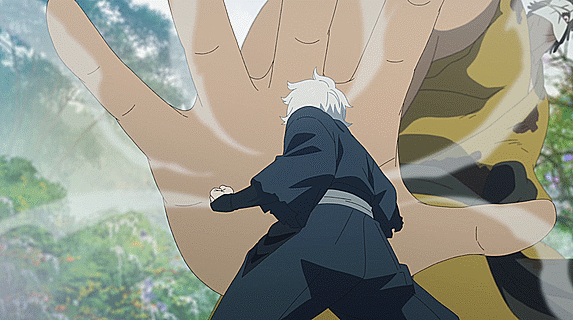

# 📿  Rokurouta

Il possède les effets **Force I** et **Résistance I.**


Il reçoit un message toutes les **5 minutes** s'il se trouve dans un rayon de **10 blocs** d'un <mark style="color:green;">**Condamné à mort**</mark>**.** Les rôles que <mark style="color:orange;">**Rokurouta**</mark> détecte sont <mark style="color:green;">**Gabimaru**</mark>, <mark style="color:green;">**Nurugai**</mark>, <mark style="color:green;">**Gantetsusai Tamiya**</mark>, <mark style="color:green;">**Akaginu**</mark>, <mark style="color:green;">**Makiya Moro**</mark>, <mark style="color:green;">**Yuzuriha**</mark> et <mark style="color:green;">**Chôbei Aza**</mark>. En les tuant il obtient **5%** de **force.** Il est détecté comme faisant partie des <mark style="color:green;">**Condamné à mort**</mark>**.**



Ayant une faim infini il possède l'effet **Hunger** de nuit.


<figure><figcaption></figcaption></figure>
